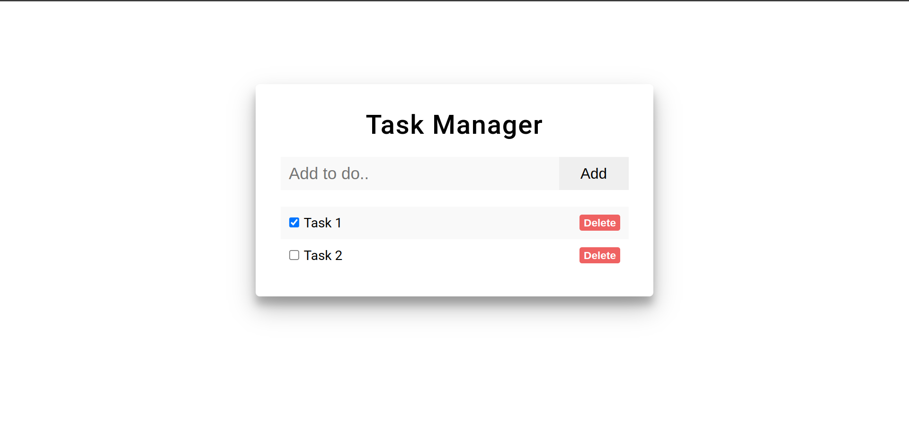

# Personal Task Manager App

- **Overview:**
  Creating a personal task manager application in React that allows users to add, delete, and mark tasks as completed. The application should use the browser's local storage to persist tasks between sessions.

- **Steps to run this project:**

  - **Step 1**
    > git clone https://github.com/bookerTee05/personal_task_manager.git
  - **Step 2**
    > npm i
  - **Step 3**
    > npm i --save-dev uuid
  - **Step 4**
    > npm run start

- **Features:**

  - **Task Management:** It functionality to add new tasks, delete tasks, and mark tasks as completed or incomplete.
  - **Storage:** Using local storage to save tasks, ensuring they are available even after the browser is closed and reopened.
  - **Error Handling:** It has basic error handling and input validation to prevent the addition of empty tasks.

- **Screen Short:**
  
